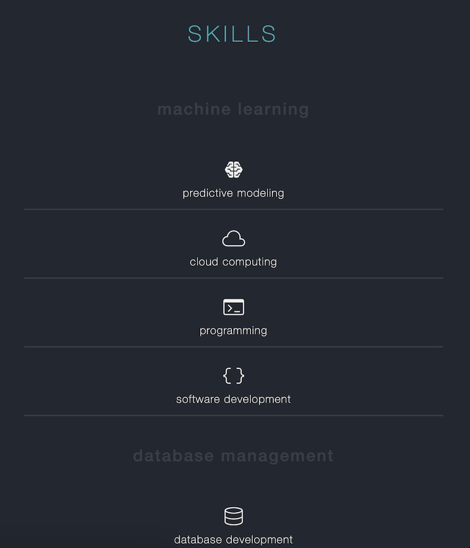

# TianaCurry.github.io

## My personal website

Web development by Tiana Curry, utilizing HTML, JavaScript, and CSS. This includes the Bootstrap framework and Google Fonts API, developed in Visual Studio Code IDE, and managed with Git. The project was deployed in 2024 and is hosted on GitHub Pages.

## Desktop View

## Mobile View Using Bootstrap

  

    
  

  

    
  

### Mobile View Demo

https://github.com/user-attachments/assets/b23c2713-98e7-4e1d-8e46-9de3ab5e3511
